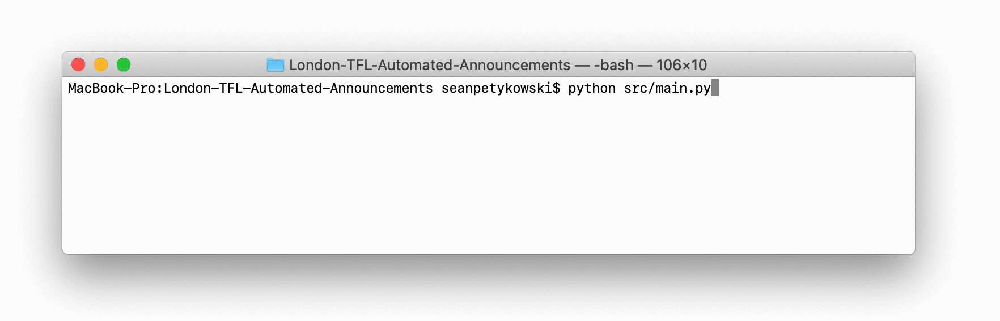

# Gap Minder

Gap Minder allows anyone to use their voice to generate station announcements that mimic the Transport for London's (TfL) automated announcements.

## Usage
### Generate Announcement

Gap Minder includes example audio files which can be used to generate announcements upon installation. Audio announcements are created via the command line interface using the following structure.



```bash
$ python gapminder.py <platform> <station>
```

**Supported Platforms**

* `1`
* `2`
* `3`
* `4`

**Supported Stations**

* `acton-town`
* `barons-court`
* `ealing-broadway`
* `ealing-common`
* `earls-court`
* `hammersmith`
* `ravenscourt-park`
* `stamford-brook`
* `turnham-green`
* `west-kensington`

## Custom Announcement Audio Segments

The following steps outline the process to record and generate custom announcements using your own voice.

### Record Audio

1. Find a Quiet Location

   Gap Minder relies on the silence between speech to extract the audio segments. Reducing or eliminating background noise is essential.

2. Determine Audio Recording Software & Hardware

   Any number of applications can be used to capture an audio recording of your voice. Select one that allows for capturing/exporting `.wav` files. Some examples include:

   * Apple GarageBank (Free)
   * Audacity (Free)
   * Logic Pro X ($$)
   * Adobe Audition ($$$)

   While the microphone on your computer will suffice, directly connecting a microphone to your computer is preferred. Some options include:

   * Computer's Built-In Mic (Free)
   * Any 3.5mm Headphone with in-line Mic ($)
   * Apple Wired EarPods ($$)
   * Zoom H4N ($$$$)

3. Locate Announcement Category Scripts

   Audio segments are grouped into 3 categories: Platforms, Stations, and Messages. In order to generate a complete set of audio files it will be important that a recording is created for each category. The category scripts can be found in `/assets/scripts/ `.

4. Record Audio Files

   An audio recording is required for each announcement category. For each script, start by clearly speaking each phrase and then allowing for a short gap between the speaking of the following phrase. End recording when all phrases have been been spoken. Repeat process for remaining scripts.

   For best results:

   * Wait at least 1 second between phrases.
   * Minimize movement during recording.
   * Record audio for all categories scripts during the same session. Changes to environment and speech can cause final results to sound choppy.

5. Export Audio Files

   Output each of the 3 recordings in a `.wav` format to any location on your computer. Make note of this location as it will be needed later when processing the audio files.

### Process Audio

The `segmenter.py` script is used to separate the audio recordings into individual station, platform, and message audio segments.

```bash
$ python segmenter.py [-t THRESHOLD] [-l MIN_LENGTH] <category> <file>
```

**Supported Categories**

* `STATIONS`
* `PLATFORMS`
* `MESSAGES`

